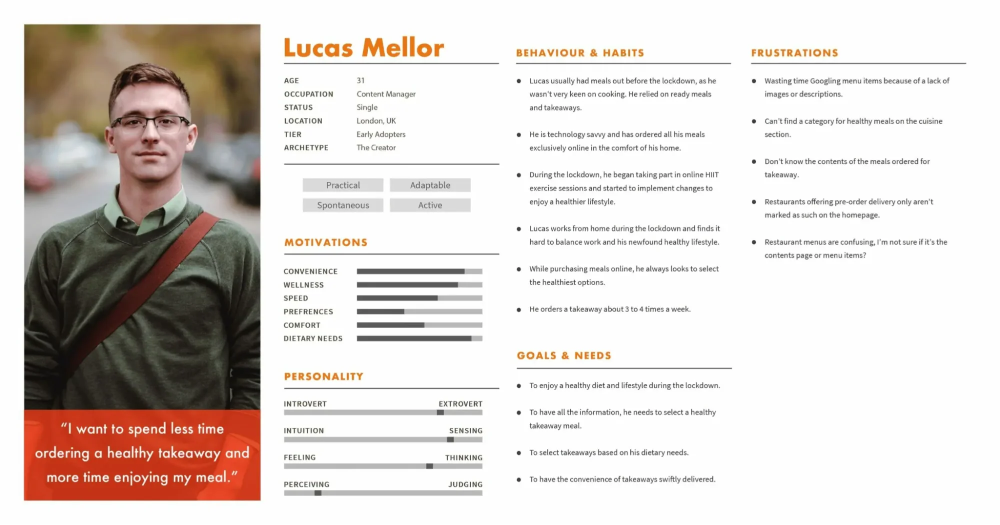

Reddit Persona Generator - Assignment Submission
-------------------------------------------------

Overview:
---------
This script takes a Reddit user profile URL as input, scrapes the user’s comments and posts, and generates a detailed user persona based on that activity. Each trait includes specific references from the user's posts or comments that were used to infer that trait.

*The goal is to give a clear picture of the user’s personality, habits, motivations, and more.*

Technologies Used:
------------------
- Python
- LangChain
- OpenAI GPT (via API)
- PRAW (Python Reddit API Wrapper)

How to Set Up and Run:
----------------------

1. Clone the Repository:
------------------------
Download the repository or use the command:

    git clone https://github.com/Pranay-Chauhn/Persona_Gen
    cd reddit-persona-generator

2. Create and Activate Virtual Environment:
-------------------------------------------
Windows:
    python -m venv .venv
    .venv\Scripts\activate

Mac/Linux:
    python3 -m venv .venv
    source .venv/bin/activate

3. Install Required Libraries:
------------------------------
Make sure you're inside the virtual environment, then run:

    pip install -r requirements.txt

4. Add Environment Variables:
-----------------------------
- Copy `.env.example` to `.env`
- Fill in your OpenAI and Reddit credentials

Example of what your `.env` should look like:

    LLM_API_BASE_URL=https://api.openai.com/v1
    LLM_API_KEY=your-openai-api-key
    LLM_MODEL_NAME=gpt-3.5-turbo

    CLIENT_ID=your-reddit-client-id
    SECRET_KEY=your-reddit-secret-key
    USERNAME=your-reddit-username
    PASSWORD=your-reddit-password

Note: You must create a Reddit app at https://www.reddit.com/prefs/apps to get the above credentials.

5. Run the Script:
------------------
Inside the root folder, run:

    python -m app.main

The script will:
- Ask for a Reddit user URL
- Scrape posts and comments
- Generate chunked data
- Extract persona traits using OpenAI
- Save the output file to: `app/outputs/user_persona.txt`

Structure of Output:
--------------------
The output will contain:
- Basic facts like name, age, occupation, etc.
- Motivation traits scored from 1–10
- MBTI personality traits
- Goals, habits, frustrations
- Supporting evidence for each trait from Reddit content

Submission Instructions:
------------------------
Ensure your GitHub repository contains:
- All source code
- `readme.txt` file (this one)
- `.env.example` file
- Sample persona output files (for sample Reddit usernames)

6. Project Workflow

                             [Chunked Reddit User Data]
                                    Run the main.py
                                         │
                             [pipeline/controller.py]
                           Calls the Controller Pipeline
                       (Including the traits you want to add)
                                         │
                           Calls the function in Chain/Runner.py
                            (This connects the entire chain)
                    ┌────────────────────┴────────────────────┐
                    │                                         │
                    ▼                                         ▼
                [Direct Fact Traits]              [Complex Traits (Aggregated)]
                    (e.g., Age, Job)                            │
                    │                                         ▼
                    ▼                             ┌─────────────────────────────┐
                [Top-K Retrieval (RAG)]           │         Descriptive         │
                    │                             │         (MapReduce)         │
                    ▼                             └─────────────────────────────┘
                [LLMChain: Trait Estimator]                      │
                    │                                            ▼
                    └────┐                               ┌──────────────┐
                         ▼                               ▼              ▼
                [Store Fact Trait]         [Motivation Ratings]   [MBTI Personality]
                                                    │                      │
                                                    ▼                      ▼
                                    [RefineDocumentsChain]   [RefineDocumentsChain]
                                                    │                      │
                                                    ▼                      ▼
                                        [Store Motivations]      [Store MBTI Trait]

